# xPlay

## Overview

xPlay is a music/movie player designed for large libraries that may be accessed through a Samba or
NFS share. Scanning every file is very time consuming and causes significant delays. xPlay therefore
makes a number of assumptions about the structure of your music or movie library. The layout for the
music library needs to be as follows.

* artist/album/track

*Examples:*

* abstrakt algebra/i/01 stigmata.flac
* abstrakt algebra/ii/09 enigma.flac
* iommi/fused/01 dopamine.flac

The movie library is setup differently. It is possible to define tags to which base directories can be
attached. The movie library scanner will not do a full recursive scan. It will scan only one sub directory
further.

*Examples:*

* [movies] /extern/movies-dvd/filme
* [movies] /extern/movies-bd/filme
* [shows] /extern/movies-dvd/serien
* [dokus] /extern/movies-bd/dokumentationen

### Remarks

I was unhappy with the current media players that try to scan and analyze each and every one of my
personal music library that contains over 65000 files. The scanning took way to long and did not have
any benefits for me.

## Library scanning

The music and movie library are scanned on every startup. The scanning functionality itself is threaded in
order to avoid any UI startup delays.

### Music library

xPlay takes advantage of the music library structure. The initial scan only reads the artists and album
directories. The scanning is so fast that there is no need for a database of scanned library entries. It
therefore can be performed each time on startup. The music view is updated after this initial scan
is complete. The files (tracks) within "artist/album" will only be scanned on demand and cached, if an
artist and corresponding album have been selected. The music library scan continues in the background in
order to fill the "artist/ablum" file (tracks) cache. The tracks itself will initially not be scanned or analyzed
in order to retrieve any media tags. They will only be analyzed if necessary. Until then only the file names are
of interest.

*Note:* The initial scan takes only a few seconds for my setup (Raspberry Pi 4 as Samba server).

### Movie library

The scanning of the movie library is significantly different due to the fact that there is less structure.
xPlay supports only one sub directory in the movie library base. All sub directories and movie files are
grouped by a tag. Each tag itself can have multiple directories associated. The movie scanning assumes that the
movie files in each of the sub directory are distinct. No duplicate names are allowed. Earlier entries will be
overwritten and previous movie file is not accessible.

## Player Backends

### Qt

The Qt backend for the music player is easy to implement using the classes QMediaPlayer and QMediaPlaylist.
The main disadvantage is the missing gapless playback.

### Phonon

The Phonon/KDE backend supports gapless playback, but it is a bit more complicated to use. On top, there seems
to be an issue calculating the length of the currently played track. I worked around this issue by utilizing
the a muted QMediaPlayer object. The Phonon backend can also be used for the movie player.

### VLC

The VLC backend is the default for the movie player. It replaces the earlier Phonon backend due to its stability.
xPlay uses the event based method for libVLC without using a QTimer thread to constantly updating the status.

## Usage

xPlay has a simple and easy to use UI interface that provides the set on functionalities that I expect from a
music and movie player. The main purpose is to navigate a huge library and play the songs or movies and display
the relevant information.

xPlay has a music view, a movie view and a streaming view. 

### Music View

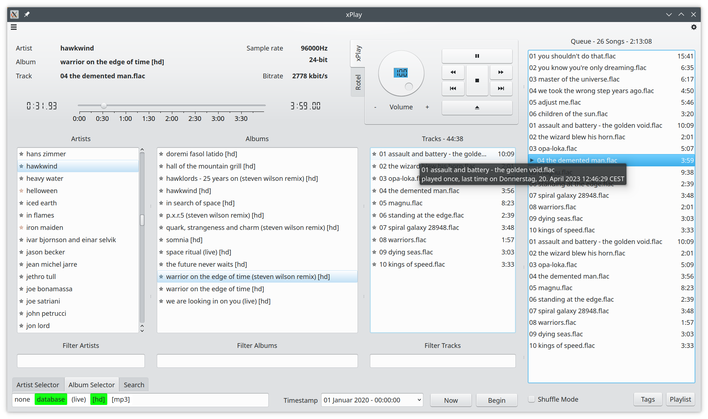
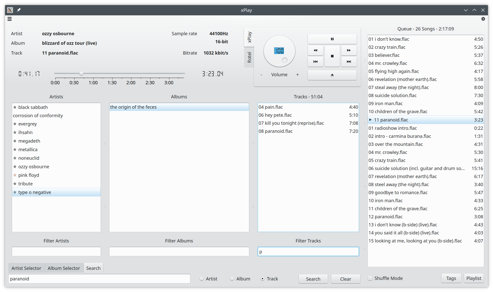
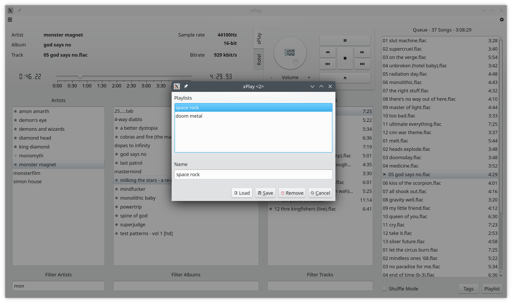
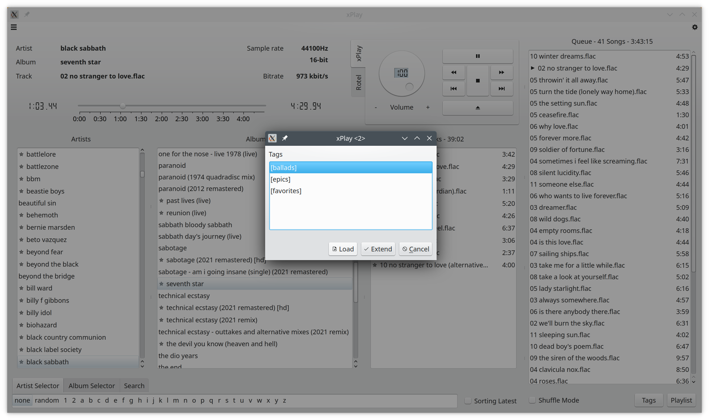

The main screen of the music view has four vertical list for the artists, album, tracks and the queue. The
album list is updated if you click (or select) on an artist and the track list is updated if you click (or select)
on an album. If you double-click on a track in the track list, then the track and the following tracks of the list
are added to the queue. If you right-click on a track in the track list, then only this track will be added to the
queue. Then entire album can be queued by a double-click on the corresponding album entry. A double-click on an
artist entry will queue all albums for the clicked artist.

The queue does support a shuffle mode in which the queued tracks will be played at random. The jump to an individual
track in the queue or the deque of a single track is not supported in shuffle mode. Each track of the queue has a
tooltip showing the artist and album the track belongs to. The playlist dialog box will open upon pressing the
*PlayList* button at the bottom of the queue. It allows to save the current queue as playlist into the database for
later use. The dialog allows for loading playlists that are stored in the database or remove any of the stored
playlists (including their entries).

The database overlay (if activated) marks every artist, album and track with a star (*) if it has been played within the
configured time period (see configuration dialog). For each track a tooltip is added that shows how many times this
track has been played and the last time it was played. The overlay makes it easier to identify music that you have not
listen too in some time or at all.

The player itself displays the artist, album and track currently played. It includes a slider to seek within the
currently played file. In addition there is player control section with a *play/pause*, *stop*, *prev*, *next*
and *clear queue* buttons and a volume dialer. If you double-click on an entry of the queue then the player jumps
to this track. Right-clicking on a queue entry will remove this track from the queue.

The artist popup menu can be accessed through a context menu by a right-click on an entry in the artist list. The 
menu entry *Link To Website* leads to the artist info which is a small simple web browser with minimal navigational 
control buttons such as home, back and forward as well as selecting a zoom factor. Pressing the *close* button will end
the artist info view. A white filled star icon indicates that no URL is currently stored within our database. A grey
filled star indicates that the URL was taken out of our database. Clicking on a white filled star will store the current
URL to the database. The database entry is removed if we click on a grey filled star.
The artist popup will also show other artists in the *Other Artists* section that have been played before or after 
the selected artist in the past. You can jump to this artist by selecting the corresponding artist popup menu entry.

Tags can be added and removed by the tag popup menu which can be accessed through a context menu by a right-click on an
entry in the track list or the queue. The tags are stored in the database. The tag dialog can be accessed by pressing 
the *Tags* button at the bottom of the queue list. The tag dialog allows to load or extend the queue with tracks that
have a specific tag.

The Rotel widget allows to control a Rotel A12 or A14 amp via a network connection. The volume can be adjusted
(maximum of 60) and the input can be selected. The values for bass and treble can be adjusted (from -10 to +10)
as well as the balance (from -5 to +5).

#### Selectors

The selectors are located at the bottom of the music view and include an artist selector, an album selector and
an a search bar.

##### Artist Selector

The artist selector list can be used to filter the artist list by the first character. The filtering is removed if
you click on *none*. If a selector is double-clicked then all selected artists with their albums are queue. A
double-click on *none* will queue the entire music library. The artist selector *random* will randomize the list of
artists. A double-click on *random* will randomize the artist list again and not add any tracks to the queue.

##### Album Selector

The album selector can be used to filter the displayed albums for an artist. The individual selectors can be modified
by double-click. A selector in white is currently not used. Selectors in green (at least one of them) must be found in
the album name. Red represents not matched selectors. An album cannot contain any of the selectors in red as part of its
album name. The *database* selector uses a mapping of artist and albums are stored in the databases and that have
been played after the given timestamp. The timestamp can easily be adjusted directly or by using the *Now* button
(current time) or the *Begin* button (beginning of the database). The *database* selector allows to easily filter for
albums that never have been played or that have recently been played. The *none* selector clears any filtering.

The filtering done by the album selector is applied whenever a selector state changes. The filtering is performed
on the music library level meaning that artists that do not have any albums that pass the album selector will be
removed from the artist list. The artist selector list is updated based on this filtered list of artists.

*Examples*

* Marking the *database* in red and marking *[hd]* in green will result in all albums being displayed that contain
  the *[hd]* tag and that have not been played since the given timestamp in the album selector.
* Marking the *(live)* in red and then double-click on an artist will queue all albums except the ones
  containing *(live)*.
 
##### Search

The search bar can be used to find an artist, album or track that contains a given substring. Put in the search text
and decide on artist, album or track to search for and then press the *Search* button to activate the filter. The
*Clear* button will remove any search based filtering. When searching for a specific track in your library only the
artists and albums are displayed that contain a track matching the search text. All tracks of the album will be
displayed, not only the tracks matching. The search based filtering will be added on top of the album selector based
filtering. It is therefore possible to search for a specific track that has not yet been played and that contains the
*(live)* tag.

### Movie View

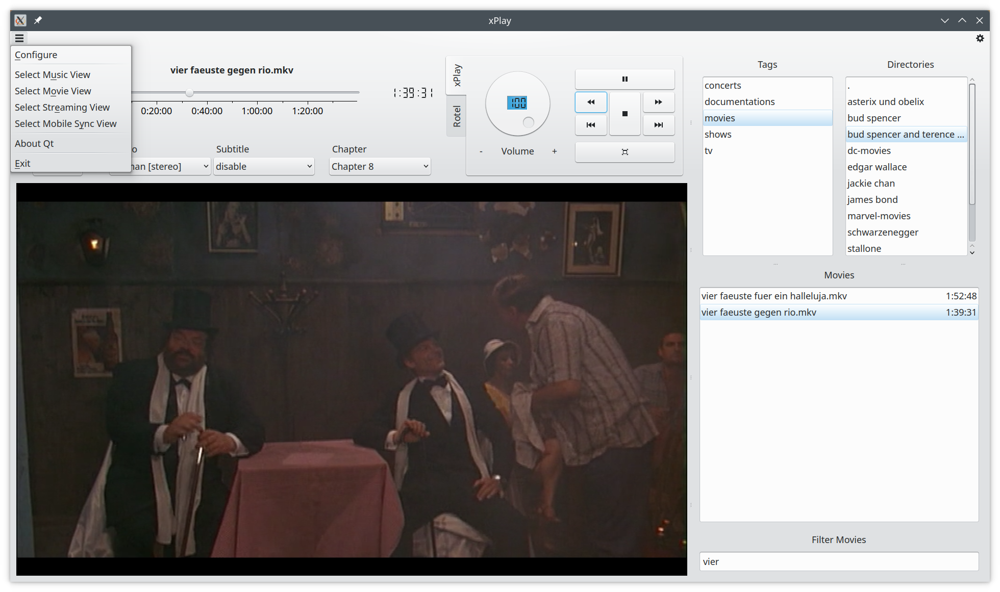

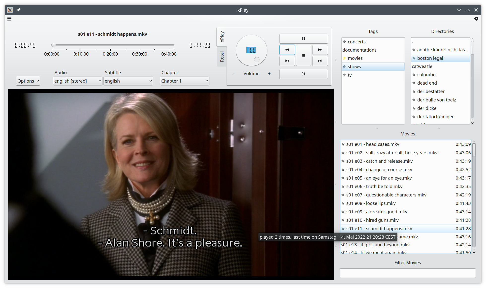

The main screen of the movie view has three vertical lists for tags, directories and movies. A tag is a
representation of one or more base directories. The directory list contains all sub directories (only one level)
of these. An additional entry "." is added for all movies that are not located within a sub directory. The
movie list displays all movie files, but this list does not act as a queue. Double-click on an entry in the
movie list will start the playback. The database overlay (if activated) will mark every tag, directory and movie
with a star (*) if it has been played within the configured time period. For each movie a tooltip is added that
displays the number of times this movie has been played and the last time it was played. The overlay helps keeping
track which episode of a show you have already seen.

The player section itself allows for seeking within the movie and selecting the audio channel or subtitle. The
control section has a *play/pause* and *stop* buttons. The *rew* and *fwd* buttons jump 60 seconds backward or
forward in the movie. The *full window* button maximizes the video output window. The currently played movie will
be displayed in the window title. The *scale and crop* checkbox may be usable for some movies that have black borders.
It is activated by default for the VLC based movie player. The video output window can also be toggled by a
double-click. In addition you can rewind and forward by 60 seconds using the left and right arrow keys. The up and down
arrow keys will increase or decrease the volume by one. The *S* key will toggle the scale and crop mode. The *ESC* key
can be used to end the full window mode. The full window mode will automatically end if the current movie is about to
end. If the *Autoplay Next* checkbox is enabled then the next movie in the movie list will be played as soon as the
current movie has ended. The player will stay in fill window mode until the last movie of the list is finished.

### Streaming View

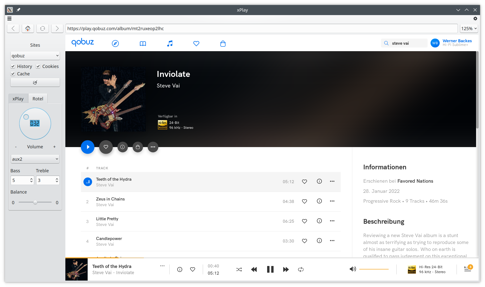
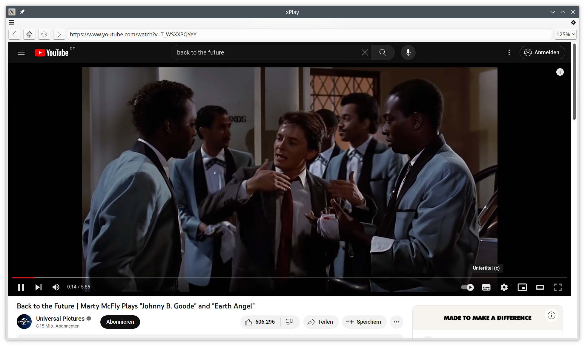

The main screen of the streaming view is basically a simple web browser using the QWebEngine. On the right side
xPlay has a number of controls. The controls include a combo box which allows us to select in between a set of
preset websites (see configuration dialog). Data for the sites, including history, cache and cookies can easily
be removed. The navigation section allows for a very basic website navigation. A control for the Rotel amp is also
available. The browser is limited by the capabilities of QWebEngine, e.g., Netflix did not work for my setup. This
may change for coming versions of QWebEngine.

### Menu

The menu has three entries *File*, *View* and *Help*. The *File* menu has four entries. The *Configure* entry
will open configuration dialog (see below). The entries *Rescan Music Library* and *Rescan Movie Library* trigger
a rescan of the currently configured music or movie library. The *Check Music Database* and *Check Movie Database*
will verify the database entries against the database. Any unknown entries will displayed in a dialog box and can be
removed. The entries *View* menu allows to switch between the *Music View*, *Movie View* or *Streaming View*.
The *Help* menu has two entries displaying copyright information about the used Qt and Qwt libraries.

#### Configuration Dialog

The configuration dialog is using QSettings to load and store the xPlay configuration. The directory and
extensions for the music and the movie library can be configured as well as the sites for the streaming view. For
movies, the default audio and subtitle language can be selected. The Rotel widget can be enabled or disabled and its
network connection can be configured. The database overlay for the music and movie view can be configured using
individual check boxes. A cut-off date can be set for each database query. If it is specified then entries with a time
stamp before the cut-off date are ignored. This features enables the user to e.g. display which movies he has seen 
the last month.

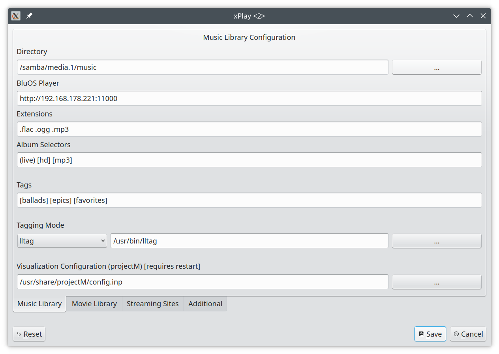
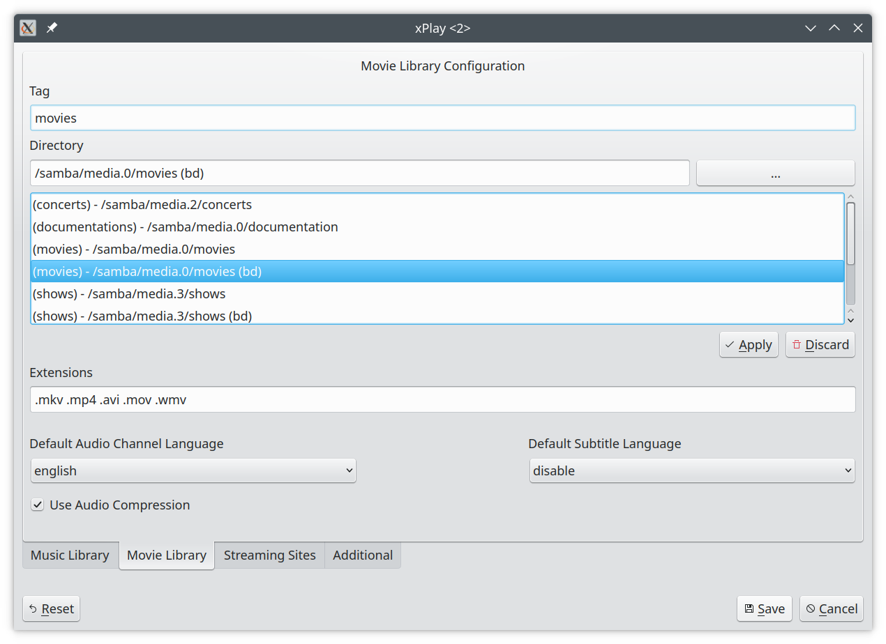

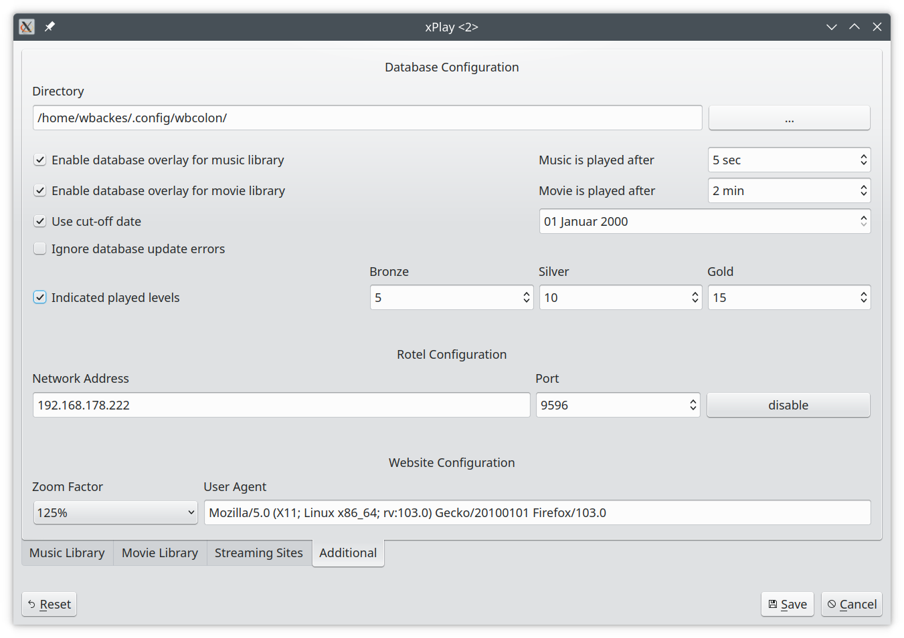

## Artwork

The media control artwork was borrowed from Wikipedia (https://en.wikipedia.org/wiki/Media_control_symbols)
and the KDE 5.x breeze icons.

## Requirements

* Qt 5.x (https://www.qt.io/)
* Phonon (https://github.com/KDE/phonon)
* Qwt 6.x for Qt5 (http://qwt.sf.net) (optional, deactivate with USE_QWT=OFF)
* SOCI - The C++ Database Access Library (http://soci.sourceforge.net/)
* TagLib Audio Meta-Data Library (https://taglib.org/)
* libVLC Library (https://wiki.videolan.org/LibVLC/)
* C++17

With Qwt the UI has an improved volume knob and track slider.

## Known Issues

* Ending the Application before the library scanning threads are finished will result in an abort return code.
* Phonon issues
    * The music player sometimes stops the playback. It can be restarted without any problems.
    * The backend should be configured to GStreamer. The VLC backend may cause issues.
    * The GStreamer backend crashed on Ubuntu 20.04 for some movies. Replacing the library
      */usr/lib/x86_64-linux-gnu/gstreamer-1.0/libgsta52dec.so* from *streamer1.0-plugins-ugly* with the
      corresponding library for Ubuntu 20.10 may solve the issue.

## Notes

xPlay started out as a little project over the weekend in order to evaluate the Clion C++ IDE.

xPlay is based in part on the work of the Qwt project (http://qwt.sf.net).

**Please support artists by buying their products.**