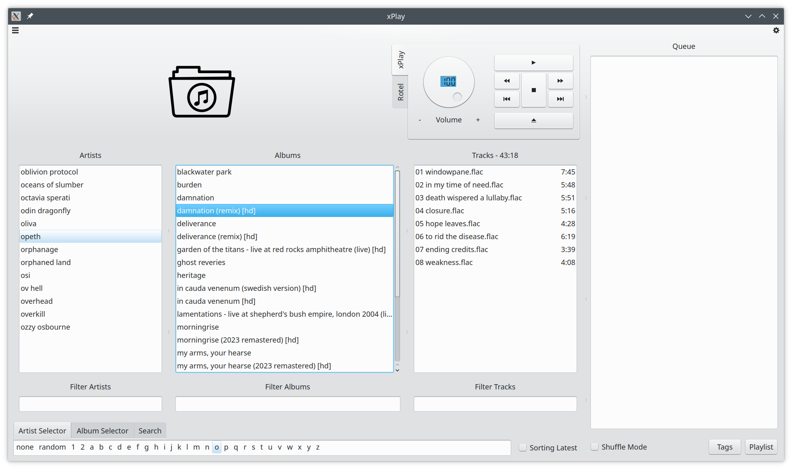
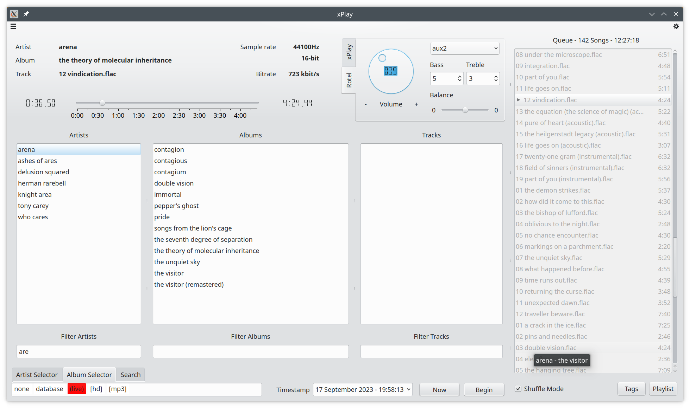
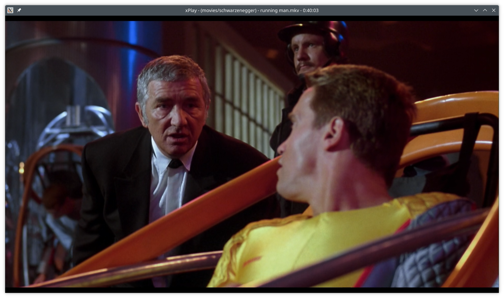

# xPlay

## Overview

xPlay is a music/movie player designed for large libraries that may be accessed through a Samba or 
NFS share. Scanning every file is very time consuming and causes significant delays. xPlay therefore 
makes a number of assumptions about the structure of your music or movie library. The layout for the 
music library needs to be as follows.

* artist/album/track

Examples:

* abstrakt algebra/i/01 stigmata.flac
* abstrakt algebra/ii/09 enigma.flac
* iommi/fused/01 dopamine.flac

The movie library is setup differently. It is possible to define tags to which base directories can be 
attached. The movie library scanner will not do a full recursive scan. It will scan only one sub directory
further.

Example:

* [movies] /extern/movies-dvd/filme
* [movies] /extern/movies-bd/filme
* [shows] /extern/movies-dvd/serien
* [dokus] /extern/movies-bd/dokumentationen

### Remarks

I was unhappy with the current media players that try to scan and analyze each and every one of my
personal music library that contains over 65000 files. The scanning took way to long and did not have 
any benefits for me.

## Library scanning

The music and movie library are scanned on every startup. The scanning functionality itself is threaded in order
to avoid any UI startup delays.

### Music library

xPlay takes advantage of the music library structure. The inital scan only reads the artists and album
directories. The scanning is so fast that there is no need for a database of scanned library entries. It
therefore can be performed each time on startup. The music view is updated after this initial scan
is complete. The files (tracks) within "artist/album" will only be scanned on demand and cached, if an 
artist and corresponding album have been selected. The music library scan continues in the background in 
order to fill the "artist/ablum" file (tracks) cache. The tracks itself will not be scanned or analyzed 
in order to retrieve any media tags. Only the file names are of interest. 
The initial scan takes less than two seconds for my setup.

### Movie library

The scanning of the movie library is significantly different due to the fact that there is less structure.
Only one sub directory is supported and displayed in the movie view. All sub directories and movie
files are grouped by tag. Each tag itself can have multiple directores. The scanning assumes that the 
movie files in each of the sub directory are distinct.

## Player Backends

### Qt

The Qt backend for the music player is easy to implement using the classes QMediaPlayer and QMediaPlaylist. 
The main disadvantage is the missing gapless playback.

### Phonon

The Phonon/KDE backend supports gapless playback, but it is a bit more complicated to use. On top, there seems
to be an issue calculating the length of the currently played track. I worked around this issue by utilizing
the a muted QMediaPlayer object. The Phonon backend in required for movie player as it supports audio channels
and subtitles.

## Usage

xPlay has a simple and easy to use UI interface that provides the set on functionalities that I expect from a
music and movie player. The main purpose is to navigate a huge library and play the songs or movies. 
xPlay has a music view, a movie view and a streaming view.  

### Music View 

The main screen of the music view has four vertical list for the artists, album, tracks and the queue. The 
album list is updated if you click (or select) on an artist and the track list is updated if you click (or select) 
on an album. If you double-click on a track in the track list, then the track and the following tracks of the list 
are added to the queue. If you right-click on a track in the track list, then only this track will be added to the 
queue. The horizontal artist selector list can be used to filter the artist list by the first character. The 
filtering is removed if you click on *none*.

The player itself displays the artist, album and track currently played. It includes a slider to seek within the
currently played file. In addition there is player control section with a *play/pause*, *stop*, *prev*, *next*
and *clear queue* buttons and a volume dialer. If you double-click on an entry of the queue then the player jumps
to this track. Right-clicking on a queue entry will remove this track from the queue.

The Rotel widget allows to control a Rotel A12 or A14 amp via a network connection. The volume can be adjusted 
(maximum of 60) and the input can be selected. The values for bass and treble can be adjusted (from -10 to +10).

### Movie View 

The main screen of the movie view has three vertical lists for tags, directories and movies. A tag is a 
representation of one or more base directories. The directory list contains all sub directories (only one level)
of these. An additional entry "." is added for all movies that are not located within a sub directory. The 
movie list displays all movie files, but this list does not act as a queue. Double-click on an entry in the 
movie list will start the playback. 

The player section itself allows for seeking within the movie and selecting the audio channel or subtitle. The
control section has a *play/pause* and *stop* buttons. The *rew* and *fwd* buttons jump 60 seconds backward or 
forward in the movie. The *full window* button maximizes the video output window. The currently played movie will
be displayed in the window title. The *scale and crop* checkbox may be usable for some movies that have black 
borders. The video output window can also be toggled by a double-click. In addition you can rewind and forward 
by 60 seconds using the left and right arrow keys. The up and down arrow keys will increase or decrease the 
volume by one. The *S* key will toggle the scale and crop mode. The *ESC* key can be used to end the full window 
mode. The full window mode will automatically end if the current movie is about to end. If the *Autoplay Next* 
checkbox is enabled then the next movie in the movie list will be played as soon as the current movie has ended. 
The player will stay in fill window mode until the last movie of the list is finished.

### Streaming View

The main screen of the streaming view is basically a simple web browser using the QWebEngine. On the right side
we have a number of controls. The controls include a combo box which allows us to select in between a set of 
preset websites (see configuration dialog). Data for the sites, including history, cache and cookies can easily
be removed. The navigation section allows for a very basic website navigation. A control for the Rotel amp is also
available. The browser is limited by the capabilities of QWebEngine, e.g., Netflix did not work in my setup. This 
may change for coming versions of QWebEngine.

### Menu

The menu has three entries *File*, *View* and *Help*. The *File* menu has four entries. The *Configure* entry 
will open configuration dialog (see below). The entries *Rescan Music Library* and *Rescan Movie Library* trigger
a rescan of the currently configured music or movie library. The entries *View* menu allows to switch between
the *Music View*, *Movie View* or *Streaming View*. The *Help* menu has two entries displaying copyright 
information about the used Qt and Qwt libraries.

#### Configuration Dialog

The configuration dialog is using QSettings to load and store the xPlay configuration. The directory and 
extensions for the music and the movie library can be configured as well as the sites for the streaming view.
The Rotel widget can be enabled or disabled and its network configuration can be configured.

## Artwork

The media control artwork has been borrowed from Wikipedia.
(https://en.wikipedia.org/wiki/Media_control_symbols)

## Requirements

* Qt 5.x
* Phonon (use Qt based music view with USE_PHONON=OFF)
* Qwt 6.x for Qt5 (optional, deactivate with USE_QWT=OFF)
* taglib
* C++17

With Qwt the UI has an improved volume knob and track slider.

## Known Issues

Ending the Application before the library scanning threads are finished will result in an abort return code.

## Notes

xPlay started out as a little project over the weekend in order to evaluate the Clion C++ IDE.

xPlay is based in part on the work of the Qwt project (http://qwt.sf.net).
 
**Please support artists by buying their products.**